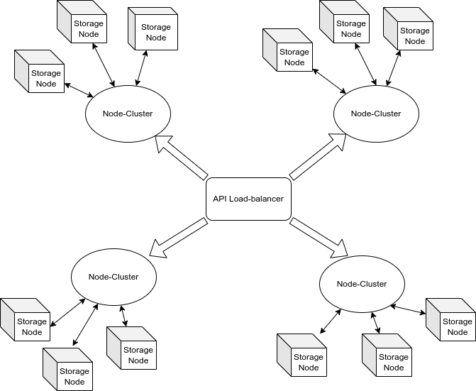

## Phase 1

## WORK IS IN PROGRESS

So we will group storage provider according to how much storage they pledged to the network.
with IPFS and IPFS-cluster, we can save much time, by not implementing everything from scratch.
Eventhough, with this algorithm, we sacrifice 3 for 1 which mean if one cluster pool pledged 1TB to the pool.
The network will only get 1TB, not 3TB.

